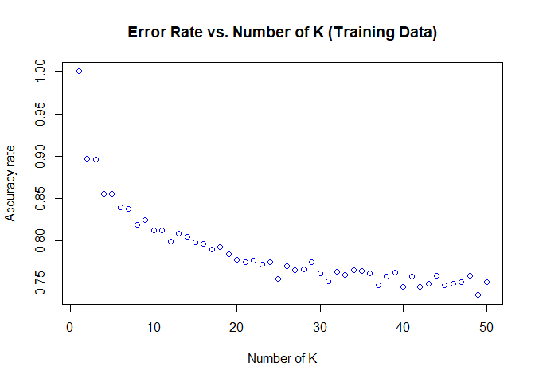

KNN\_Report
================

Being a simple and fast machine learning algorithm, KNN is one of the most used ML algorithm. I, here use KNN alogirthm to classify a given email as spam or non-spam based 57 different textual characterstics 3220 emails.The traininig data is popular spambase dataset available at (<https://archive.ics.uci.edu/ml/datasets/Spambase>). Based on this data set we try to find out an optimum value of K in KNN classification and use it to classify emails saved as .txt files

``` r
#Import Libraries
library('FNN')
library ('caret')
library ('dplyr')
library ('ggplot2')
```

``` r
#Set working directory
setwd('C:/Users/spb65/Desktop/Applied Machine Learning')

#Read the data
train = read.csv('spam_train.csv')

#####This part calculates the percentage of NA in each Column###
################################################################
Perc_na = function(data){
#Get the number of rows in the dataframe
Rows = nrow(data)
#Get the name of the columns
Cols = length(data)
for (i in c(1:Cols)){
  Name = names(data[i])
  NAs = sum(is.na(data[, i]))
  Percent = (NAs/Rows)*100
  if (Percent>0)
    print (paste('The percent of NA in', Name, 'is', Percent, sep= ' '))
}
}
#####################################################################
#####################################################################
```

``` r
Perc_na(train)
```

    ## [1] "The percent of NA in capital_run_length_average is 20.527950310559"

As we can see one column in the dataset has a very high percentage of NA, and if we remove rows with NA we will lose a significant proportion of data. Another possible way could be removing the columns with high proportion mf NA. However, capital\_run\_length\_average may be an important variable so we opt to impute new data based on KNN classifiaction itself.

``` r
#Remove the response variable from the data impute and add the response variable
library('DMwR')
toimpute = subset(train, select = -c(spam))
Imputed = knnImputation(toimpute, k =15, scale=T)
Imputed$spam = train$spam
```

    ##     Min.  1st Qu.   Median     Mean  3rd Qu.     Max. 
    ##    1.000    1.678    2.304    5.247    3.752 1102.500

    ##     Min.  1st Qu.   Median     Mean  3rd Qu.     Max.     NA's 
    ##    1.000    1.600    2.281    4.943    3.800 1102.500      661

As we can see, imputation removed the 661 NAs from the data however there is no significant difference in the summary statistics.

``` r
##Write function to calculate accuracy rate of the KNN classifier##
#############Function Starts Here##############################
error_calc = function(classifier, label){k =0 
for (j in 1:length(classifier)){
  if (classifier[j]==label[j])
    k = k+1
}
return(k/length(classifier))}
#############Function Ends Here################################
###############################################################

##Create a data frame with three 50 rows and three columns
error_rate = data.frame (matrix(ncol = 3, nrow=50))
```

``` r
for (i in 1:50){
  
  library(dplyr)
  train = sample_frac(Imputed, 0.7)
  sid<-as.numeric(rownames(train)) # because rownames() returns character
  test = Imputed[-sid,]
  
  classifier1 = knn(train[, -c(58)], train[, -c(58)], train$spam, k = i, algorithm=c("kd_tree"))
  classifier2 = knn(train[, -c(58)], test[, -c(58)], train$spam, k = i, algorithm=c("kd_tree"))
  
  ##Enter the error rates and number of k in the empty data frame by calling error_rate function
  error_rate$X1[i] = i
  error_rate$X2[i] = error_calc(classifier1, train$spam)
  error_rate$X3[i] = error_calc(classifier2, test$spam)
}
```

``` r
plot(error_rate$X1, error_rate$X2, col = 'blue', main = 'Error Rate vs. Number of K (Training Data)', xlab = 'Number of K', ylab = 'Accuracy rate' )
```



``` r
plot(error_rate$X1, error_rate$X3, col = 'red',  main = 'Error Rate vs. Number of K (Test Data)', xlab = 'Number of K', ylab = 'Accuray rate' )
```


The nature of the Accuracy vs K plot defies the intuition of overfitting. I had expected that that the accuracy for test data would reach maximum at a K value distant from 1, but it is not so. I therefore, conducted 10 fold cross validation to check if the result is any different.

``` r
library('caret')
Imputed$spam = factor(Imputed$spam)
kcontrol = trainControl(method = 'cv', number = 2)
fit = train (spam ~ ., method ='knn', tuneGrid = expand.grid(k = 1:50), trControl = kcontrol, metric ='Accuracy', data =Imputed)
fit
```

    ## k-Nearest Neighbors 
    ## 
    ## 3220 samples
    ##   57 predictor
    ##    2 classes: '0', '1' 
    ## 
    ## No pre-processing
    ## Resampling: Cross-Validated (2 fold) 
    ## Summary of sample sizes: 1610, 1610 
    ## Resampling results across tuning parameters:
    ## 
    ##   k   Accuracy   Kappa    
    ##    1  0.7720497  0.5201472
    ##    2  0.7580745  0.4915941
    ##    3  0.7714286  0.5158877
    ##    4  0.7527950  0.4764455
    ##    5  0.7608696  0.4928011
    ##    6  0.7565217  0.4850706
    ##    7  0.7618012  0.4958766
    ##    8  0.7577640  0.4863831
    ##    9  0.7571429  0.4852173
    ##   10  0.7534161  0.4767246
    ##   11  0.7487578  0.4667580
    ##   12  0.7456522  0.4612297
    ##   13  0.7437888  0.4563711
    ##   14  0.7413043  0.4506484
    ##   15  0.7416149  0.4510374
    ##   16  0.7425466  0.4543160
    ##   17  0.7431677  0.4562746
    ##   18  0.7369565  0.4428332
    ##   19  0.7391304  0.4472157
    ##   20  0.7363354  0.4410267
    ##   21  0.7397516  0.4490808
    ##   22  0.7375776  0.4445988
    ##   23  0.7375776  0.4455338
    ##   24  0.7344720  0.4395761
    ##   25  0.7329193  0.4346431
    ##   26  0.7288820  0.4253621
    ##   27  0.7291925  0.4267015
    ##   28  0.7304348  0.4306204
    ##   29  0.7310559  0.4310781
    ##   30  0.7310559  0.4298447
    ##   31  0.7319876  0.4331911
    ##   32  0.7279503  0.4249000
    ##   33  0.7276398  0.4247254
    ##   34  0.7322981  0.4335488
    ##   35  0.7282609  0.4260080
    ##   36  0.7276398  0.4245549
    ##   37  0.7316770  0.4331665
    ##   38  0.7298137  0.4284081
    ##   39  0.7257764  0.4200997
    ##   40  0.7267081  0.4219936
    ##   41  0.7267081  0.4226742
    ##   42  0.7257764  0.4208082
    ##   43  0.7267081  0.4223347
    ##   44  0.7263975  0.4223788
    ##   45  0.7242236  0.4182012
    ##   46  0.7270186  0.4236044
    ##   47  0.7220497  0.4124397
    ##   48  0.7257764  0.4205413
    ##   49  0.7282609  0.4257341
    ##   50  0.7270186  0.4229522
    ## 
    ## Accuracy was used to select the optimal model using the largest value.
    ## The final value used for the model was k = 1.

``` r
plot(fit)
```


Surprisingly, even the K-fold cross validation shows that the model performs best at k = 1. However, choosing k =1 is very much against the idea of difference in nature of accuracy in training and test data caused due to overfitting. I, therefore opt to choose 3 or 7 as the optimal value of k.
